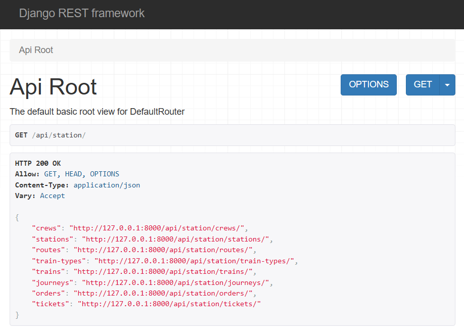
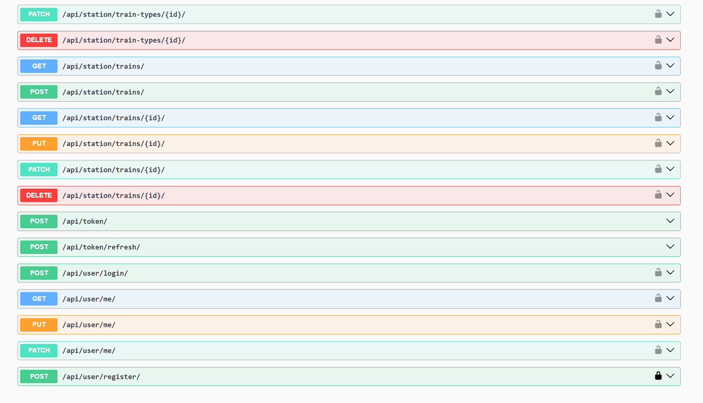

# Train Station API Service:

Django API project for managing trains, crew, routes, stations, tickets, orders, etc.

## Features

- JWT authentication
- Admin panel available at /admin/
- API documentation accessible at /api/doc/swagger/ or /api/doc/redoc/
- Manage orders and tickets
- Admin-only features for creating and managing routes, stations, trains (including train types), journeys, and crew
- Upload images for trains

## Installation

```
git clone https://github.com/haldaniko/TrainStation-DjangoAPI.git
cd TrainStation-DjangoAPI

# on macOS
python3 -m venv venv
source venv/bin/activate

# on Windows
python -m venv venv
venv\Scripts\activate
    
pip install -r requirements.txt

(Copy .env.sample to .env and populate it with all required data)

python manage.py migrate
python manage.py loaddata train_station_service_db_data.json
python manage.py createsuperuser
python manage.py runserver
   
python manage.py test
```

API will be available at http://127.0.0.1:8000/api/

## Structure


## Demo

---
