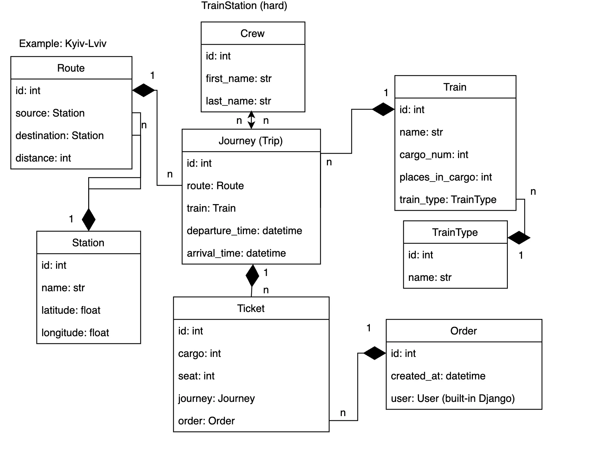

# Train Station API Service:

Django API project for managing trains, crew, routes, stations, tickets, orders, etc. 

## Instalation

    git clone https://github.com/haldaniko/train-station-api-service.git
    cd train-station-api-service
    
    # on macOS
    python3 -m venv venv
    source venv/bin/activate

    # on Windows
    python -m venv venv
    venv\Scripts\activate
    
    pip install -r requirements.txt
    
    python manage.py migrate
    python manage.py loaddata train_station_service_db_data.json
    python manage.py createsuperuser
    python manage.py runserver
   
    (API will be available at http://127.0.0.1:8000/api/)
    python manage.py test

## Features

- JWT authentication
- Admin panel available at /admin/
- API documentation accessible at /api/doc/swagger/ or /api/doc/redoc/
- Manage orders and tickets
- Admin-only features for creating and managing routes, stations, trains (including train types), journeys, and crew
- Upload images for trains

## Structure

